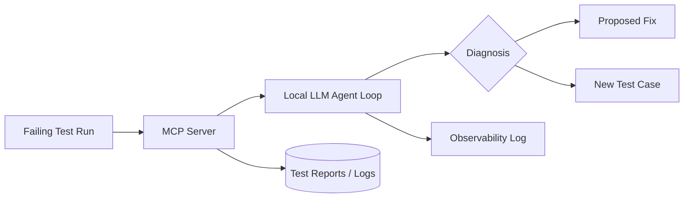

# Architecture

## System Diagram

<!-- Replace with your actual diagram (Excalidraw, draw.io, or keep as mermaid) -->

[FILL IN: adjust the diagram to match what you actually built]

## Component Breakdown

### 1. [Component name, e.g. "MCP Server"]
- **What it does:** [FILL IN]
- **Why it's separate:** [FILL IN: e.g. isolates tool execution from the reasoning loop, can be swapped/sandboxed independently]
- **Talks to:** [FILL IN]

### 2. [Component name, e.g. "Agent Loop"]
- **What it does:** [FILL IN]
- **Why it's separate:** [FILL IN]
- **Talks to:** [FILL IN]

<!-- Repeat for each real component: local model runtime, CI hook, observability layer, etc. -->

## The Agent Loop

<!-- Concretely, as numbered steps. This is often what an interviewer asks
you to walk through live: write it so you could read it back verbatim. -->

1. [FILL IN: e.g. Agent receives a failing test report path]
2. [FILL IN: e.g. Agent calls `get_last_failure_log` via MCP]
3. [FILL IN: e.g. Model reasons over the log, decides next tool call or produces a diagnosis]
4. [FILL IN: e.g. Loop continues until the model emits a final answer or hits a step limit]
5. [FILL IN: e.g. Result is logged and optionally posted as a CI comment]

## Model Choice & Trade-offs

- **Model:** [FILL IN]
- **Quantization:** [FILL IN]
- **Measured throughput:** [FILL IN: tokens/sec on your hardware]
- **Why this model over alternatives:** [FILL IN]
- **What you'd change with a GPU / more budget:** [FILL IN]

Full numbers: [`docs/benchmarks.md`](benchmarks.md)

## MCP Design

- **Tools exposed:** [FILL IN: list each tool, its purpose, its schema]
- **Why these specific tools:** [FILL IN]
- **Transport:** [FILL IN: stdio / HTTP-SSE, and why]
- **Schema design notes:** [FILL IN: what you learned about writing schemas/docstrings that actually get reliable tool calls]

## Observability

- **What's logged:** [FILL IN: every tool call, every model decision, timestamps, inputs/outputs]
- **How you'd debug a bad run:** [FILL IN]
- **Tooling used:** [FILL IN: plain structured logs / Langfuse / other]

## Failure Modes

<!-- A strong signal of seniority. Be honest and specific. -->

| Failure | What happens | Mitigation |
|---|---|---|
| Model hallucinates a root cause | [FILL IN] | [FILL IN] |
| Tool call fails / times out | [FILL IN] | [FILL IN] |
| Proposed fix is wrong | [FILL IN] | [FILL IN] |

## Security Model

- **Sandboxing:** [FILL IN: Docker, restricted filesystem/network access]
- **Least privilege:** [FILL IN: what the MCP server can and can't touch]
- **Prompt injection considerations:** [FILL IN: relevant if the agent reads untrusted logs/web content]

Full details: [`docs/security-model.md`](security-model.md)

## Alternatives Considered

<!-- Shows judgment, not just execution -->

- **Hand-rolled agent loop vs. LangGraph/CrewAI:** [FILL IN: why you started hand-rolled, when you'd reach for a framework]
- **[Other alternative you weighed]:** [FILL IN]
